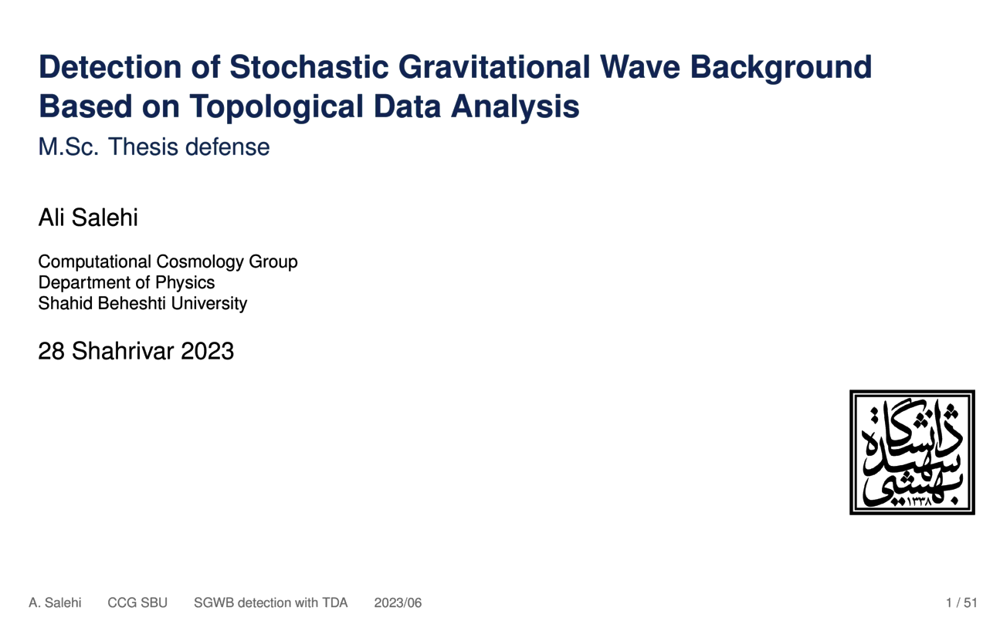

# Beamer presentation: thesis defense

This is a more comprehensive version of my M.Sc. thesis defence session presentation. Made using the template created by [Johannes Dorfner](https://github.com/ojdo).

The thesis: [Detection of Stochastic Gravitational Wave Background Based on Topological Data Analysis](http://ccg.sbu.ac.ir/people/ali-salehi/)

## Preview

*Preview via [Converting PDF slides to animated GIFs and videos with ImageMagick](http://phyletica.org/imagemagick/) by [Jamie Oaks](http://github.com/joaks1).*
